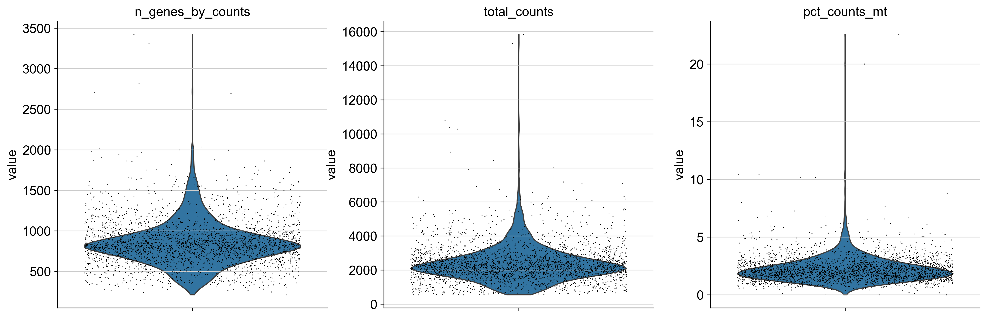
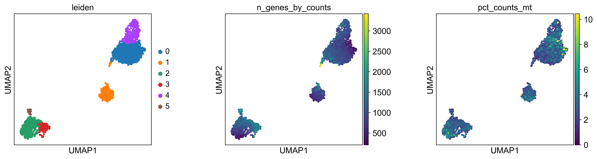
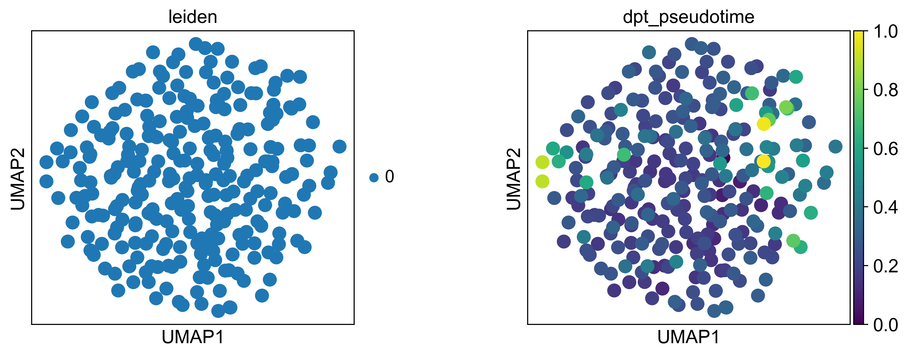
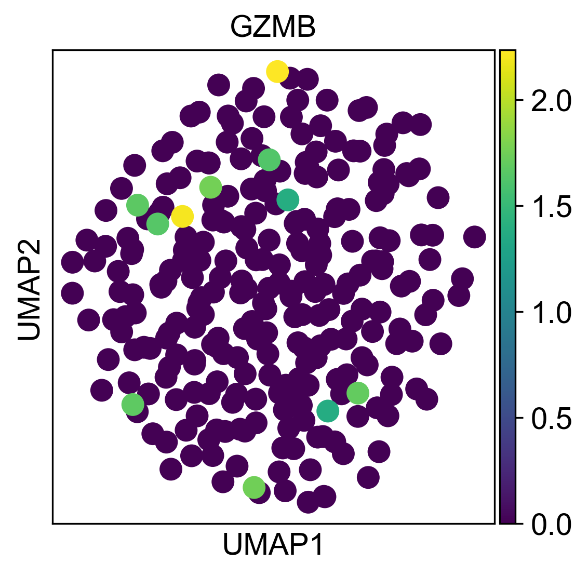
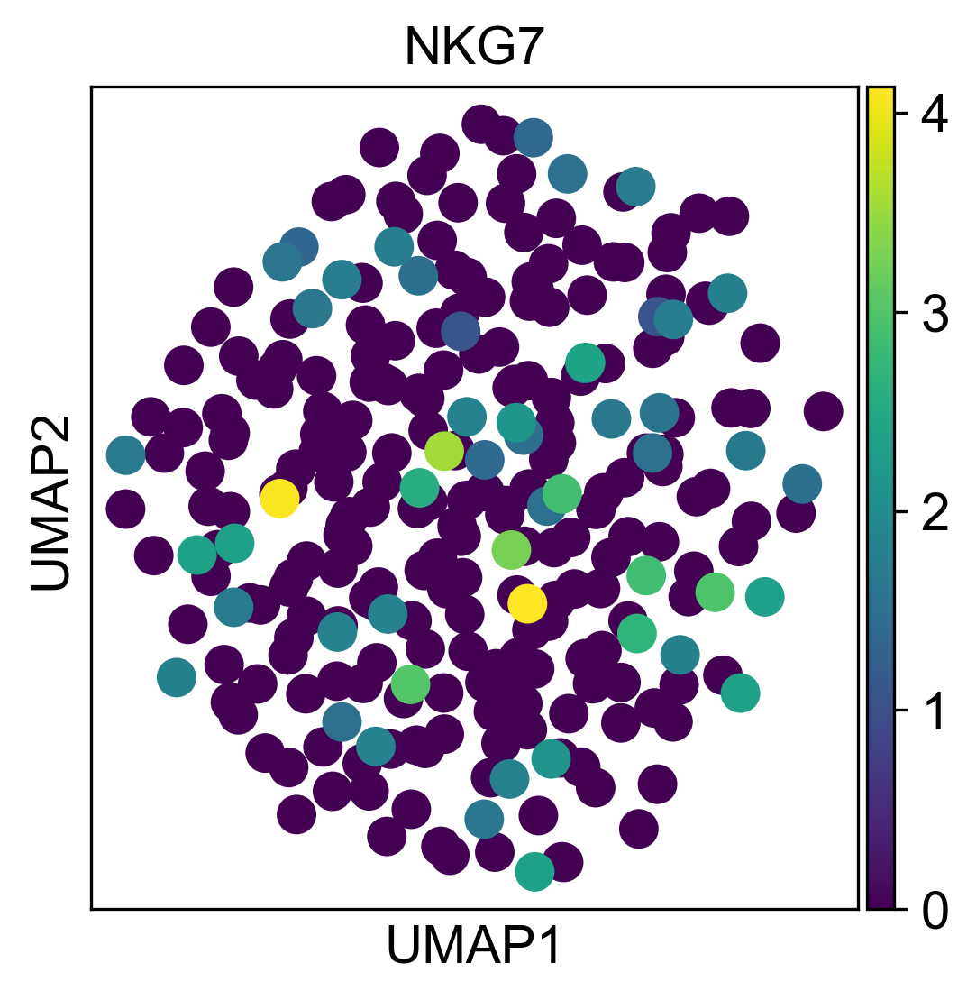

# scRNA-cd4-precursors

A reproducible single-cell RNA-seq analysis pipeline (Scanpy) for identifying CD4⁺ transitional activation states and precursor manifolds in human immune tissue.

Therapeutic context: Resolving CD4⁺ precursor state continua is directly relevant to understanding tumor-infiltrating lymphocyte (TIL) dysfunction, autoimmune effector programs, and the cellular substrates of immune checkpoint response — all active areas in next-generation immunotherapy development.

---

## Scientific Motivation

Immune pathology often emerges from transitional cellular states rather than fully differentiated effector populations. Resolving these intermediate activation programs is critical for identifying early regulatory checkpoints and therapeutically actionable precursors.

This project demonstrates how single-cell RNA-seq analysis can be used to uncover such state continua within CD4⁺ T cell compartments.

---
# Key Results

Results below are generated from the demo pipeline run on the Scanpy `pbmc3k` dataset. Disease datasets can be substituted following the instructions in *How to Reproduce*.

---

## Quality Control Metrics

The pipeline performs standard single-cell QC filtering based on:

- Number of detected genes per cell  
- Total UMI counts  
- Mitochondrial transcript percentage  

<p align="center">
  
</p>

Cells with low gene complexity or elevated mitochondrial content are removed prior to downstream analysis.

---

## Global Immune Structure (UMAP + Leiden Clustering)

Dimensionality reduction and Leiden clustering reveal canonical PBMC populations.

<p align="center">
  
</p>

Cluster annotation is supported by canonical lineage markers:

- **LTB** → T cells  
- **NKG7 / GZMB** → cytotoxic programs  
- **MS4A1** → B cells  
- **LYZ / FCGR3A** → myeloid subsets  

<p align="center">
  
</p>

These results validate the integrity of preprocessing, dimensionality reduction, and clustering.

---

## CD4⁺-Enriched Subset and Activation Manifold

CD4⁺ cells are enriched using expression of CD4 and IL7R markers, followed by recomputation of neighborhood graphs and embedding.

Within this subset, diffusion pseudotime (DPT) reveals a **continuous transcriptional manifold** spanning:

| State | Canonical Markers | Pseudotime Position |
|-------|------------------|--------------------|
| Naïve-like | CCR7⁺, IL7R⁺, SELL⁺ | Root |
| Transitional activation | CD44⁺, IL2RA⁺ | Intermediate |
| Effector-associated | GZMB⁺, PRF1⁺, KLRG1⁺ | Terminal |

<p align="center">
  
</p>

This continuum supports the presence of transcriptionally plastic precursor states that may seed inflammatory or cytotoxic populations in disease.

Diffusion geometry captures nonlinear transitions that are not resolvable in bulk RNA-seq analyses.

---

## Gene Program Gradients Along Pseudotime

Expression of effector-associated genes (e.g., GZMB, NKG7) is enriched toward regions of the embedding corresponding to later pseudotime, consistent with progressive activation rather than purely discrete clustering.

<p align="center">
  
  
</p>


---

## Pipeline Overview

1. Raw counts input (`.h5ad`)
2. Quality control filtering  
   - Remove low-gene cells  
   - Remove high mitochondrial content cells  
3. Library-size normalization + `log1p`
4. Highly variable gene selection (2,000 HVGs)
5. PCA (50 components)
6. kNN graph construction (`n_neighbors=10`)
7. UMAP embedding (`min_dist=0.3`)
8. Leiden clustering
9. CD4⁺ enrichment (CD4 / IL7R scoring)
10. Diffusion pseudotime (DPT) with naïve-like root
11. Cluster-wise differential expression

All analysis implemented in Scanpy (Python).


---

## Parameterization

Key parameters used in demo:

- HVGs: 2,000
- PCA components: 50
- kNN neighbors: 10
- UMAP min_dist: 0.3
- Leiden resolution: 0.5
- DPT root: naïve-like CD4 cluster (CCR7⁺ enriched)

All parameters are modifiable in the notebook.

---

## Translational Relevance
This pipeline is structured for direct application to inflammatory and oncology datasets:
### Cancer Immunology
Identifying CD4⁺ precursor exhaustion states in tumor-infiltrating lymphocytes (TILs) to predict checkpoint response.

### Autoimmunity
Tracing pathogenic CD4⁺ differentiation trajectories in IBD, lupus, or RA cohorts to identify early activation programs.

### Antibody Target Discovery
Surface proteins dynamically regulated along CD4⁺ precursor continua (e.g., CD38, LAG3, TIGIT) may represent rational bispecific engagement targets.


---

## Demo Dataset

This repository uses the Scanpy `pbmc3k` dataset as a lightweight reference dataset to validate preprocessing, clustering, and pseudotime steps before applying the pipeline to disease cohorts.


---

## Repository Structure
```text
scRNA-cd4-precursors/
├── notebooks/
├── images/
│   ├── qc_violin.png
│   ├── umap_leiden.png
│   ├── marker_panels.png
│   ├── cd4_pseudotime.png
│   ├── gzmb_nkg7.png
├── environment.yml
├── README.md
├── LICENSE
└── .gitignore

```
---

## How to Reproduce

### 1. Create environment

```bash
conda env create -f environment.yml
conda activate sc-mini
```

### 2. Launch notebook
```bash
jupyter notebook notebooks/cd4_activation_analysis.ipynb
```

### 3. Apply to your own dataset
To analyze a disease dataset:
- Place an `.h5ad` file in a data/ directory
- Modify the data-loading cell in the notebook accordingly
- Re-run the pipeline
The analysis is designed to generalize across immune-focused single-cell datasets.

---
## Author
**Aradhana**

PhD Student, Biomedical Engineering at Duke University

contact: aradhana2515@gmail.com

